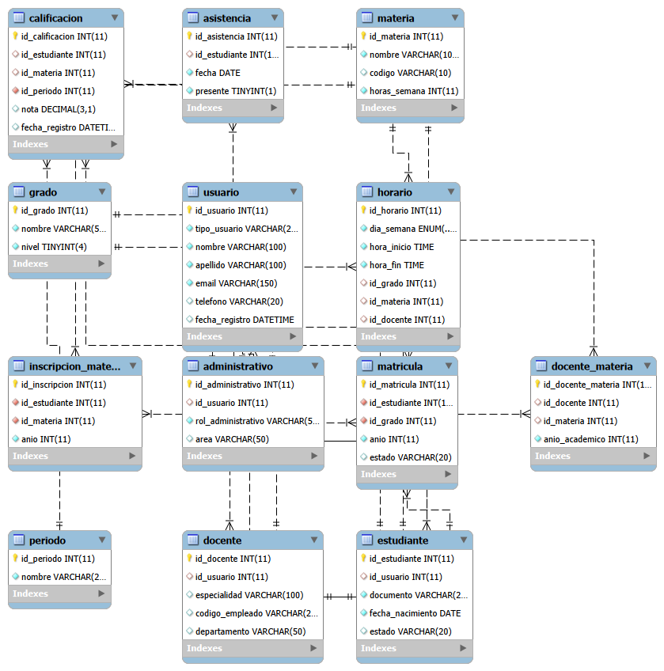

# Design Document

By Fredy Acosta

Video overview: https://youtu.be/v4-M2I6_0DY
---

## Scope

The purpose of this database is to model and manage the core operations of an academic institution. It provides a structured way to store and relate information about students, teachers, subjects, enrollments, grades, schedules, and attendance.

Within the scope of this database are the primary entities involved in a school environment, including users (students, teachers, administrative staff), academic structures such as grades and subjects, and operational data such as enrollments, class assignments, and evaluations. The system also includes academic periods to allow tracking of performance over time.

Outside the scope of this database are features such as authentication systems, financial management (tuition or payments), multi-institution support, and graphical user interfaces. Additionally, advanced academic rules such as prerequisites, curriculum planning, or automated promotion logic are not included.

---

## Functional Requirements

A user of this database should be able to:

* Register and manage users (students, teachers, administrative staff)
* Enroll students into grades for specific academic years
* Assign subjects to students
* Assign teachers to subjects
* Record and query student grades by academic period
* Track student attendance
* Manage class schedules
* Perform analytical queries, such as identifying students without enrollments or calculating average grades

Beyond the scope of this database, users are not able to:

* Authenticate or manage secure login sessions
* Interact through a graphical interface
* Process payments or financial transactions
* Automatically enforce complex academic policies (e.g., passing conditions or prerequisites)

---

## Representation

### Entities

The database includes the following entities:

* **usuario**: Stores general user information such as name, surname, email, and type. Attributes include `id_usuario`, `nombre`, `apellido`, `email`, and `tipo_usuario`. The `email` field is unique to prevent duplication.

* **estudiante**: Represents students and links to `usuario`. Attributes include `id_estudiante`, `id_usuario`, `documento`, and `fecha_nacimiento`. A unique constraint on `documento` ensures identity integrity.

* **docente**: Represents teachers. Attributes include `id_docente`, `id_usuario`, and fields such as specialization or department.

* **administrativo**: Represents administrative staff with attributes linked to `usuario`.

* **grado**: Represents academic levels. Attributes include `id_grado`, `nombre`, and `nivel`.

* **materia**: Represents subjects. Attributes include `id_materia`, `nombre`, `codigo`, and `horas_semana`. The `codigo` is unique to avoid duplication.

* **periodo**: Represents academic periods. Attributes include `id_periodo` and `nombre`.

* **matricula**: Represents student enrollment per year and grade. Attributes include `id_matricula`, `id_estudiante`, `id_grado`, `anio`, and `estado`.

* **inscripcion_materia**: Represents the many-to-many relationship between students and subjects. Attributes include `id_inscripcion`, `id_estudiante`, `id_materia`, and `anio`.

* **docente_materia**: Represents assignment of teachers to subjects. Attributes include `id_docente_materia`, `id_docente`, `id_materia`, and `anio_academico`.

* **horario**: Represents schedules. Attributes include `id_horario`, `dia_semana`, `hora_inicio`, `hora_fin`, and foreign keys to grade, subject, and teacher. The `dia_semana` uses an ENUM to restrict valid values.

* **calificacion**: Represents grades. Attributes include `id_calificacion`, `id_estudiante`, `id_materia`, `id_periodo`, and `nota`. The use of `DECIMAL` ensures precision.

* **asistencia**: Represents attendance records. Attributes include `id_asistencia`, `id_estudiante`, `fecha`, and `presente`.

The data types were chosen to balance efficiency and accuracy. For example, `INT` is used for identifiers for performance, `VARCHAR` for flexible text fields, `DATE` and `DATETIME` for temporal data, and `DECIMAL` for grades to preserve numeric precision.

Constraints such as primary keys, foreign keys, unique constraints, and ENUM types were used to ensure data integrity and prevent invalid or inconsistent data.

---

### Relationships

The relationships between entities are defined using foreign keys:

* A `usuario` can be associated with a `estudiante`, `docente`, or `administrativo`.
* A `estudiante` can have multiple `matricula` records over different years.
* A `estudiante` can have multiple `calificacion` records.
* A `materia` is linked to students through `inscripcion_materia` (many-to-many).
* A `docente` is linked to subjects through `docente_materia`.
* A `calificacion` is linked to a `periodo` to track academic performance over time.
* A `horario` connects `grado`, `materia`, and `docente`.

These relationships reflect real-world academic structures and enforce referential integrity.

---

## Optimizations

Several optimizations were implemented in the database design:

* Indexes on foreign key columns to improve JOIN performance
* Unique constraints on fields such as `email`, `documento`, and `codigo`
* Normalization to reduce redundancy and improve consistency
* Use of ENUM in `horario` to restrict invalid values
* Use of appropriate data types such as `DECIMAL` for grades and `DATE` for temporal data

These optimizations enhance query efficiency and maintain data quality.

---

## Limitations

This database has several limitations:

* It does not include authentication or role-based access control
* It is designed for a single institution and does not support multi-tenant environments
* It lacks advanced academic logic such as prerequisites or automatic promotion rules
* It does not include a user interface for interaction
* It does not enforce complex validation beyond SQL constraints

Additionally, while the schema is scalable, performance considerations for very large datasets (e.g., indexing strategies or partitioning) are not fully explored.

Despite these limitations, the design provides a solid foundation for an academic management system and can be extended in future iterations.
